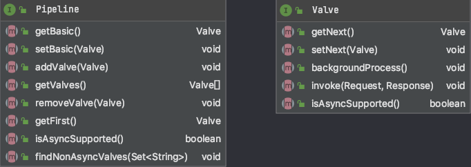

# Tomcat面经

### 00. 你对Tomcat的理解。
- 推荐书籍:《Tomcat架构解析》
- Tomcat源码: https://github.com/apache/tomcat/tree/8.5.x (该分支为8.5.x版本)

### 01. Tomcat中涉及到的设计模式有哪些？具体说明。
- 职责链模式
  - 模式讲解:
  - 在Tomcat中的应用：Tomcat基于"职责链模式"实现客户端请求的处理  
    &emsp;&emsp;Tomcat中定义了Pipeline(管道)和Value(阀)两个接口。前者用于构建职责链，后者代表职责链上的每个处理器。Tomcat中的每个请求都需要经过容器中的每个组件(Engine、Host、Context、Wrapper)，其中每个组件对该请求都可能存在某些操作。换句话说，在Tomcat中每个Container组件通过执行一个职责链来完成具体的请求处理。 
      
    &emsp;&emsp;如上图，在Pipline中维护了一个Value数组，每个Value数组中均存在一个针对请求进行处理的Invoke()方法，当一个请求过来时，会依次经过Pipeline中的每个Value，并触发Invoke()方法，实现对请求的处理。
  - 优点:  
      1. 能够确保整体架构的可伸缩性和可扩展性
      2. 能够提高每个组件的灵活性、使其同样易于扩展  
         &emsp;&emsp;Pipeline中的每个Value之间解耦，便于新增/删除/修改每个Value而不影响别的Value，
    
- 模板模式
- 组合模式
- 适配器模式
- 观察者模式