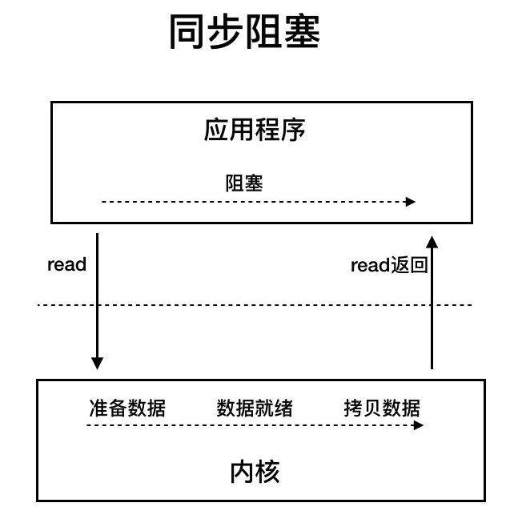
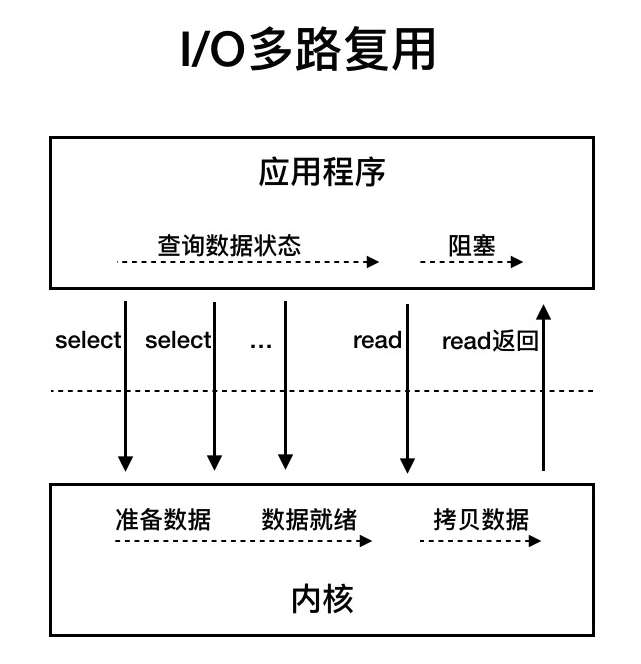

# IO模型

### Unix系统的5种IO模型
- 同步阻塞IO   
  
  
- 同步非阻塞IO
- 多路复用IO   
  &emsp;&emsp;IO多路复用模型本质上仍然是同步非阻塞IO，只是在其基础上，使用了线程进行select调用，向内核查多个数据通道的状态。
  
- 异步IO
- 信号驱动IO

### Java实现的IO模型
- NIO --> 同步非阻塞IO
- NIO.2 --> 异步IO